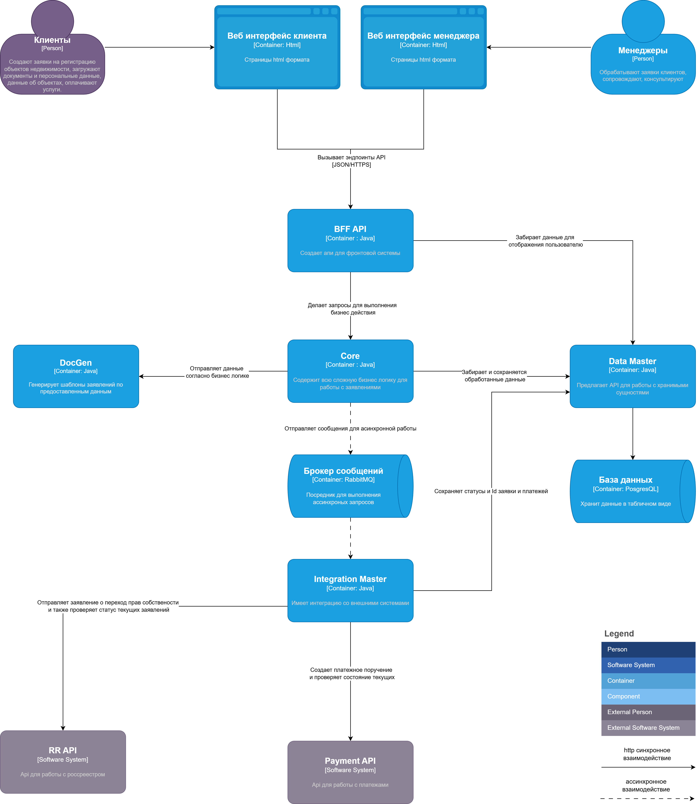

Система для регистрации перехода права собственности

# Имеет две роли
- Клиент - продавец, покупатель - предоставляют данные об объекте, подписывают заявления, оплачивают, получают документы о переходе права собственности
- Менеджер - работник, помогает провести сделку, проверяет документы, общается с клиентом

# Система состоит из сервисов
- BFF API -  image (bff-api:version) - апи для фронта, предоставляет простые эндпоинты для взаимодействия с системой 
- Core - image (core:version) - центральные сервис, содержит всю сложную бизнес логику для работы с заявлениями, валидирует, преобразует и сохраняет данные, также отправляет запросы на генерацию заявление через DocGen
- Data Master -  image (data-master:version) - Предлагает простое API для работы с хранимыми сущностями, интегрирован с СУБД PostgresQL
- DocGen image - (bff-api:version) - сервис для генерации файлов заявлений на основании предоставленных данных
- Integration Master - image (integration-master:version) - сервис для интеграции со внешними системами (Росреестр, платежный сервис), общается с Core сервисом по средством RabbitMQ, так как внешние бизнес процессы занимают много времени, состояния процессов проверяет поллингом внешних систем, состояния записывает через Data Master
- PostgresQL - реляционная СУБД
- RabbitMQ - брокер сообщений

# Внешние сервисы 
- Росреестр (https://reestr-api.ru/) - API по которым принимает заявления на регистрацию и также может предоставить статус по текущим заявлениям
- Payment Api (https://api.yookassa.ru/v3/) - API по которым можно формировать платежное поручение и проверять статус оплат


# Сущности k8s вне схемы

- ConfigMap - для хранения настроек сервисов - уровень логирования, даты скидок и имена очередей и хостов RabbitMq
- Secret - для хранения ключей и логинов сервисов RabitMQ и PostgresQL, а так же токенов от api внешних сервисов
- Job image (db-migrator:version) - для выполнения миграций в СУБД
- CronJob image (maintenance:version) - для удаления временных файлов в СУБД
- Ingress для входа в кластер из сети интернет

# Схема взамодействия


```yaml
---
apiVersion: v1
kind: Namespace
metadata:
  name: prop-reg
  labels:
    name: prop-reg

---
apiVersion: v1
kind: ConfigMap
metadata:
  name: prop-reg-config
  namespace: prop-reg
data:
  LOG_LEVEL: "INFO"
  DISCOUNT_FROM: "2026-01-01"
  DISCOUNT_TO: "2026-01-31"
  RABBITMQ_HOST: "rabbitmq"
  RABBITMQ_PORT: "5672"
  RABBITMQ_CORE_TO_INT_QUEUE: "core.to.integration"
  RABBITMQ_INT_TO_CORE_QUEUE: "integration.to.core"
  POSTGRES_HOST: "postgres"
  POSTGRES_PORT: "5432"
  POSTGRES_DB: "main"

---
apiVersion: v1
kind: Secret
metadata:
  name: postgres-secret
  namespace: prop-reg
type: Opaque
stringData:
  POSTGRES_PASSWORD: "pswd"

---
apiVersion: v1
kind: Secret
metadata:
  name: rabbitmq-secret
  namespace: prop-reg
type: Opaque
stringData:
  RABBITMQ_PASSWORD: "pswd"

---
apiVersion: v1
kind: Secret
metadata:
  name: api-tokens-secret
  namespace: prop-reg
type: Opaque
stringData:
  REESTR_API_TOKEN: "SomeToken"
  YOOKASSA_SECRET_KEY: "SomeToken"

# =========================
# PostgreSQL (StatefulSet)
# =========================
---
apiVersion: v1
kind: Service
metadata:
  name: postgres
  namespace: prop-reg
spec:
  clusterIP: None
  selector:
    app: postgres
  ports:
    - name: pg
      port: 5432
      targetPort: 5432

---
apiVersion: apps/v1
kind: StatefulSet
metadata:
  name: postgres
  namespace: prop-reg
spec:
  serviceName: postgres
  replicas: 1
  selector:
    matchLabels:
      app: postgres
  template:
    metadata:
      labels:
        app: postgres
    spec:
      containers:
        - name: postgres
          image: postgres:16
          ports:
            - containerPort: 5432
          env:
            - name: POSTGRES_DB
              valueFrom:
                configMapKeyRef:
                  name: prop-reg-config
                  key: POSTGRES_DB
            - name: POSTGRES_USER
              valueFrom:
                secretKeyRef:
                  name: postgres-secret
                  key: POSTGRES_USER
            - name: POSTGRES_PASSWORD
              valueFrom:
                secretKeyRef:
                  name: postgres-secret
                  key: POSTGRES_PASSWORD
          volumeMounts:
            - name: pgdata
              mountPath: /var/lib/postgresql/data
          resources:
            requests:
              cpu: "300m"
              memory: "1Gi"
            limits:
              cpu: "1500m"
              memory: "2Gi"
          readinessProbe:
            tcpSocket:
              port: 5432
            initialDelaySeconds: 5
            periodSeconds: 10
          livenessProbe:
            tcpSocket:
              port: 5432
            initialDelaySeconds: 20
            periodSeconds: 20
  volumeClaimTemplates:
    - metadata:
        name: pgdata
      spec:
        accessModes: ["ReadWriteOnce"]
        resources:
          requests:
            storage: 50Gi

# =========================
# RabbitMQ (StatefulSet)
# =========================
---
apiVersion: v1
kind: Service
metadata:
  name: rabbitmq
  namespace: prop-reg
spec:
  clusterIP: None
  selector:
    app: rabbitmq
  ports:
    - name: amqp
      port: 5672
      targetPort: 5672
    - name: mgmt
      port: 15672
      targetPort: 15672

---
apiVersion: apps/v1
kind: StatefulSet
metadata:
  name: rabbitmq
  namespace: prop-reg
spec:
  serviceName: rabbitmq
  replicas: 1
  selector:
    matchLabels:
      app: rabbitmq
  template:
    metadata:
      labels:
        app: rabbitmq
    spec:
      containers:
        - name: rabbitmq
          image: rabbitmq:3.13-management
          ports:
            - containerPort: 5672
            - containerPort: 15672
          env:
            - name: RABBITMQ_DEFAULT_USER
              valueFrom:
                secretKeyRef:
                  name: rabbitmq-secret
                  key: RABBITMQ_USER
            - name: RABBITMQ_DEFAULT_PASS
              valueFrom:
                secretKeyRef:
                  name: rabbitmq-secret
                  key: RABBITMQ_PASSWORD
          volumeMounts:
            - name: rmqdata
              mountPath: /var/lib/rabbitmq
          resources:
            requests:
              cpu: "200m"
              memory: "512Mi"
            limits:
              cpu: "1000m"
              memory: "1Gi"
          readinessProbe:
            tcpSocket:
              port: 5672
            initialDelaySeconds: 10
            periodSeconds: 10
          livenessProbe:
            tcpSocket:
              port: 5672
            initialDelaySeconds: 30
            periodSeconds: 20
  volumeClaimTemplates:
    - metadata:
        name: rmqdata
      spec:
        accessModes: ["ReadWriteOnce"]
        resources:
          requests:
            storage: 10Gi

# =========================
# App Services (ClusterIP)
# =========================
---
apiVersion: v1
kind: Service
metadata:
  name: bff-api
  namespace: prop-reg
spec:
  type: ClusterIP
  selector:
    app: bff-api
  ports:
    - name: http
      port: 80
      targetPort: 8080

---
apiVersion: v1
kind: Service
metadata:
  name: core
  namespace: prop-reg
spec:
  type: ClusterIP
  selector:
    app: core
  ports:
    - name: http
      port: 80
      targetPort: 8080

---
apiVersion: v1
kind: Service
metadata:
  name: data-master
  namespace: prop-reg
spec:
  type: ClusterIP
  selector:
    app: data-master
  ports:
    - name: http
      port: 80
      targetPort: 8080

---
apiVersion: v1
kind: Service
metadata:
  name: docgen
  namespace: prop-reg
spec:
  type: ClusterIP
  selector:
    app: docgen
  ports:
    - name: http
      port: 80
      targetPort: 8080

---
apiVersion: v1
kind: Service
metadata:
  name: integration-master
  namespace: prop-reg
spec:
  type: ClusterIP
  selector:
    app: integration-master
  ports:
    - name: http
      port: 80
      targetPort: 8080

# =========================
# Ingress
# =========================
---
apiVersion: networking.k8s.io/v1
kind: Ingress
metadata:
  name: prop-reg-ingress
  namespace: prop-reg
  annotations:
    nginx.ingress.kubernetes.io/proxy-read-timeout: "120"
    nginx.ingress.kubernetes.io/proxy-send-timeout: "120"
spec:
  ingressClassName: nginx
  rules:
    - host: prop-reg.example.com
      http:
        paths:
          - path: /api
            pathType: Prefix
            backend:
              service:
                name: bff-api
                port:
                  number: 80

# =========================
# Deployments
# =========================
---
apiVersion: apps/v1
kind: Deployment
metadata:
  name: bff-api
  namespace: prop-reg
spec:
  replicas: 2
  selector:
    matchLabels:
      app: bff-api
  template:
    metadata:
      labels:
        app: bff-api
    spec:
      containers:
        - name: bff-api
          image: registry.example.com/propreg/bff-api:1.0.0
          ports:
            - containerPort: 8080
          envFrom:
            - configMapRef:
                name: prop-reg-config
            - secretRef:
                name: postgres-secret
            - secretRef:
                name: rabbitmq-secret
            - secretRef:
                name: api-tokens-secret
          resources:
            requests:
              cpu: "100m"
              memory: "256Mi"
            limits:
              cpu: "500m"
              memory: "512Mi"
          readinessProbe:
            httpGet:
              path: /health/ready
              port: 8080
            initialDelaySeconds: 5
            periodSeconds: 10
          livenessProbe:
            httpGet:
              path: /health/live
              port: 8080
            initialDelaySeconds: 20
            periodSeconds: 20

---
apiVersion: apps/v1
kind: Deployment
metadata:
  name: core
  namespace: prop-reg
spec:
  replicas: 2
  selector:
    matchLabels:
      app: core
  template:
    metadata:
      labels:
        app: core
    spec:
      containers:
        - name: core
          image: registry.example.com/propreg/core:1.0.0
          ports:
            - containerPort: 8080
          envFrom:
            - configMapRef:
                name: prop-reg-config
            - secretRef:
                name: postgres-secret
            - secretRef:
                name: rabbitmq-secret
            - secretRef:
                name: api-tokens-secret
          resources:
            requests:
              cpu: "200m"
              memory: "512Mi"
            limits:
              cpu: "1000m"
              memory: "1Gi"
          readinessProbe:
            httpGet:
              path: /health/ready
              port: 8080
            initialDelaySeconds: 5
            periodSeconds: 10
          livenessProbe:
            httpGet:
              path: /health/live
              port: 8080
            initialDelaySeconds: 20
            periodSeconds: 20

---
apiVersion: apps/v1
kind: Deployment
metadata:
  name: data-master
  namespace: prop-reg
spec:
  replicas: 2
  selector:
    matchLabels:
      app: data-master
  template:
    metadata:
      labels:
        app: data-master
    spec:
      containers:
        - name: data-master
          image: registry.example.com/propreg/data-master:1.0.0
          ports:
            - containerPort: 8080
          envFrom:
            - configMapRef:
                name: prop-reg-config
            - secretRef:
                name: postgres-secret
            - secretRef:
                name: rabbitmq-secret
            - secretRef:
                name: api-tokens-secret
          resources:
            requests:
              cpu: "200m"
              memory: "512Mi"
            limits:
              cpu: "1000m"
              memory: "1Gi"
          readinessProbe:
            httpGet:
              path: /health/ready
              port: 8080
            initialDelaySeconds: 5
            periodSeconds: 10
          livenessProbe:
            httpGet:
              path: /health/live
              port: 8080
            initialDelaySeconds: 20
            periodSeconds: 20

---
apiVersion: apps/v1
kind: Deployment
metadata:
  name: docgen
  namespace: prop-reg
spec:
  replicas: 2
  selector:
    matchLabels:
      app: docgen
  template:
    metadata:
      labels:
        app: docgen
    spec:
      containers:
        - name: docgen
          image: registry.example.com/propreg/docgen:1.0.0
          ports:
            - containerPort: 8080
          envFrom:
            - configMapRef:
                name: prop-reg-config
            - secretRef:
                name: postgres-secret
            - secretRef:
                name: rabbitmq-secret
            - secretRef:
                name: api-tokens-secret
          resources:
            requests:
              cpu: "150m"
              memory: "384Mi"
            limits:
              cpu: "800m"
              memory: "768Mi"
          readinessProbe:
            httpGet:
              path: /health/ready
              port: 8080
            initialDelaySeconds: 5
            periodSeconds: 10
          livenessProbe:
            httpGet:
              path: /health/live
              port: 8080
            initialDelaySeconds: 20
            periodSeconds: 20

---
apiVersion: apps/v1
kind: Deployment
metadata:
  name: integration-master
  namespace: prop-reg
spec:
  replicas: 2
  selector:
    matchLabels:
      app: integration-master
  template:
    metadata:
      labels:
        app: integration-master
    spec:
      containers:
        - name: integration-master
          image: registry.example.com/propreg/integration-master:1.0.0
          ports:
            - containerPort: 8080
          envFrom:
            - configMapRef:
                name: prop-reg-config
            - secretRef:
                name: postgres-secret
            - secretRef:
                name: rabbitmq-secret
            - secretRef:
                name: api-tokens-secret
          env:
            - name: REESTR_BASE_URL
              value: "https://reestr-api.ru"
            - name: PAYMENT_BASE_URL
              value: "https://api.yookassa.ru/v3"
          resources:
            requests:
              cpu: "200m"
              memory: "512Mi"
            limits:
              cpu: "1200m"
              memory: "1Gi"
          readinessProbe:
            httpGet:
              path: /health/ready
              port: 8080
            initialDelaySeconds: 5
            periodSeconds: 10
          livenessProbe:
            httpGet:
              path: /health/live
              port: 8080
            initialDelaySeconds: 20
            periodSeconds: 20

# =========================
# Job: DB migrations
# =========================
---
apiVersion: batch/v1
kind: Job
metadata:
  name: db-migrations
  namespace: prop-reg
spec:
  backoffLimit: 2
  template:
    metadata:
      labels:
        job: db-migrations
    spec:
      restartPolicy: Never
      containers:
        - name: migrator
          image: registry.example.com/propreg/db-migrator:1.0.0
          envFrom:
            - configMapRef:
                name: prop-reg-config
            - secretRef:
                name: postgres-secret
            - secretRef:
                name: rabbitmq-secret
            - secretRef:
                name: api-tokens-secret
          resources:
            requests:
              cpu: "100m"
              memory: "256Mi"
            limits:
              cpu: "500m"
              memory: "512Mi"

# =========================
# CronJob: cleanup temp files
# =========================
---
apiVersion: batch/v1
kind: CronJob
metadata:
  name: cleanup-temp-files
  namespace: prop-reg
spec:
  schedule: "30 3 * * *"
  concurrencyPolicy: Forbid
  jobTemplate:
    spec:
      backoffLimit: 1
      template:
        metadata:
          labels:
            job: cleanup-temp-files
        spec:
          restartPolicy: Never
          containers:
            - name: cleanup
              image: registry.example.com/propreg/maintenance:1.0.0
              envFrom:
                - configMapRef:
                    name: prop-reg-config
                - secretRef:
                    name: postgres-secret
                - secretRef:
                    name: rabbitmq-secret
                - secretRef:
                    name: api-tokens-secret
              resources:
                requests:
                  cpu: "50m"
                  memory: "128Mi"
                limits:
                  cpu: "200m"
                  memory: "256Mi"

# =========================
# Network Policies
# =========================
---
apiVersion: networking.k8s.io/v1
kind: NetworkPolicy
metadata:
  name: default-deny-ingress
  namespace: prop-reg
spec:
  podSelector: {}
  policyTypes:
    - Ingress

---
apiVersion: networking.k8s.io/v1
kind: NetworkPolicy
metadata:
  name: allow-ingress-to-bff
  namespace: prop-reg
spec:
  podSelector:
    matchLabels:
      app: bff-api
  policyTypes:
    - Ingress
  ingress:
    - from:
        - namespaceSelector:
            matchLabels:
              kubernetes.io/metadata.name: ingress-nginx
      ports:
        - protocol: TCP
          port: 8080

---
apiVersion: networking.k8s.io/v1
kind: NetworkPolicy
metadata:
  name: allow-bff-egress
  namespace: prop-reg
spec:
  podSelector:
    matchLabels:
      app: bff-api
  policyTypes:
    - Egress
  egress:
    - to:
        - podSelector:
            matchLabels:
              app: core
      ports:
        - protocol: TCP
          port: 8080
    - to:
        - podSelector:
            matchLabels:
              app: data-master
      ports:
        - protocol: TCP
          port: 8080
    - to:
        - namespaceSelector:
            matchLabels:
              kubernetes.io/metadata.name: kube-system
      ports:
        - protocol: UDP
          port: 53
        - protocol: TCP
          port: 53

---
apiVersion: networking.k8s.io/v1
kind: NetworkPolicy
metadata:
  name: core-traffic
  namespace: prop-reg
spec:
  podSelector:
    matchLabels:
      app: core
  policyTypes:
    - Ingress
    - Egress
  ingress:
    - from:
        - podSelector:
            matchLabels:
              app: bff-api
        - podSelector:
            matchLabels:
              app: integration-master
      ports:
        - protocol: TCP
          port: 8080
  egress:
    - to:
        - podSelector:
            matchLabels:
              app: data-master
      ports:
        - protocol: TCP
          port: 8080
    - to:
        - podSelector:
            matchLabels:
              app: docgen
      ports:
        - protocol: TCP
          port: 8080
    - to:
        - podSelector:
            matchLabels:
              app: rabbitmq
      ports:
        - protocol: TCP
          port: 5672
    - to:
        - namespaceSelector:
            matchLabels:
              kubernetes.io/metadata.name: kube-system
      ports:
        - protocol: UDP
          port: 53
        - protocol: TCP
          port: 53

---
apiVersion: networking.k8s.io/v1
kind: NetworkPolicy
metadata:
  name: data-master-traffic
  namespace: prop-reg
spec:
  podSelector:
    matchLabels:
      app: data-master
  policyTypes:
    - Ingress
    - Egress
  ingress:
    - from:
        - podSelector:
            matchLabels:
              app: core
        - podSelector:
            matchLabels:
              app: docgen
        - podSelector:
            matchLabels:
              app: integration-master
        - podSelector:
            matchLabels:
              app: bff-api
      ports:
        - protocol: TCP
          port: 8080
  egress:
    - to:
        - podSelector:
            matchLabels:
              app: postgres
      ports:
        - protocol: TCP
          port: 5432
    - to:
        - namespaceSelector:
            matchLabels:
              kubernetes.io/metadata.name: kube-system
      ports:
        - protocol: UDP
          port: 53
        - protocol: TCP
          port: 53

---
apiVersion: networking.k8s.io/v1
kind: NetworkPolicy
metadata:
  name: docgen-traffic
  namespace: prop-reg
spec:
  podSelector:
    matchLabels:
      app: docgen
  policyTypes:
    - Ingress
    - Egress
  ingress:
    - from:
        - podSelector:
            matchLabels:
              app: core
      ports:
        - protocol: TCP
          port: 8080
  egress:
    - to:
        - podSelector:
            matchLabels:
              app: data-master
      ports:
        - protocol: TCP
          port: 8080
    - to:
        - namespaceSelector:
            matchLabels:
              kubernetes.io/metadata.name: kube-system
      ports:
        - protocol: UDP
          port: 53
        - protocol: TCP
          port: 53

---
apiVersion: networking.k8s.io/v1
kind: NetworkPolicy
metadata:
  name: integration-master-traffic
  namespace: prop-reg
spec:
  podSelector:
    matchLabels:
      app: integration-master
  policyTypes:
    - Ingress
    - Egress
  ingress:
    - from:
        - podSelector:
            matchLabels:
              app: core
      ports:
        - protocol: TCP
          port: 8080
  egress:
    - to:
        - podSelector:
            matchLabels:
              app: data-master
      ports:
        - protocol: TCP
          port: 8080
    - to:
        - podSelector:
            matchLabels:
              app: rabbitmq
      ports:
        - protocol: TCP
          port: 5672
    - to:
        - ipBlock:
            cidr: 0.0.0.0/0
      ports:
        - protocol: TCP
          port: 443
    - to:
        - namespaceSelector:
            matchLabels:
              kubernetes.io/metadata.name: kube-system
      ports:
        - protocol: UDP
          port: 53
        - protocol: TCP
          port: 53

---
apiVersion: networking.k8s.io/v1
kind: NetworkPolicy
metadata:
  name: postgres-ingress
  namespace: prop-reg
spec:
  podSelector:
    matchLabels:
      app: postgres
  policyTypes:
    - Ingress
  ingress:
    - from:
        - podSelector:
            matchLabels:
              app: data-master
        - podSelector:
            matchLabels:
              job: db-migrations
      ports:
        - protocol: TCP
          port: 5432

---
apiVersion: networking.k8s.io/v1
kind: NetworkPolicy
metadata:
  name: rabbitmq-ingress
  namespace: prop-reg
spec:
  podSelector:
    matchLabels:
      app: rabbitmq
  policyTypes:
    - Ingress
  ingress:
    - from:
        - podSelector:
            matchLabels:
              app: core
        - podSelector:
            matchLabels:
              app: integration-master
      ports:
        - protocol: TCP
          port: 5672
```